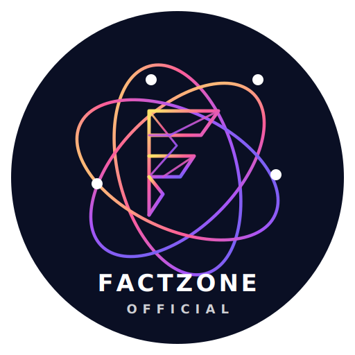

<!DOCTYPE html>
<html lang="en">
<head>

<link rel="author" href="humans.txt">

<meta charset="UTF-8">

<meta name="viewport"
content="width=device-width, initial-scale=1.0">

<title>
FactZone Official | Amazing Facts, Science Facts & Viral Knowledge
</title>

<meta name="description"
content="FactZone Official is a Hindi educational platform sharing amazing facts, science facts, technology facts, history facts and viral knowledge.">

<meta name="keywords"
content="facts, amazing facts, science facts, technology facts, history facts, viral facts, hindi facts">

<!-- SEO -->

<meta name="robots" content="index,follow,max-image-preview:large">

<meta name="googlebot"
content="index,follow,max-image-preview:large">

<meta name="author"
content="Avnish Ravat">

<meta name="theme-color"
content="#000000">

<link rel="canonical"
href="https://factzone.online">

<!-- Open Graph -->

<meta property="og:type"
content="website">

<meta property="og:title"
content="FactZone Official | Amazing Facts">

<meta property="og:description"
content="Amazing facts, science facts, technology facts and educational knowledge.">

<meta property="og:url"
content="https://factzone.online">

<meta property="og:image"
content="https://factzone.onlinelogo.png">

<!-- Twitter -->

<meta name="twitter:card"
content="summary_large_image">

<meta name="twitter:title"
content="FactZone Official">

<meta name="twitter:description"
content="Amazing facts and educational platform">

<meta name="twitter:image"
content="https://factzone.onlinelogo.png">

<!-- FAVICON -->

<link rel="icon"
href="logo.svg">

<!-- ADSENSE -->

<!-- SCHEMA SEO -->

<!-- TAILWIND -->

  

  
</head>

<body>

<!-- HEADER -->

<header
class="bg-black sticky top-0 z-50 shadow-lg">

<a href="index.html"
class="flex items-center gap-3">

<h1
class="text-3xl font-bold text-white">
FactZone
</h1>

</a>

<input
type="text"
id="searchInput"
placeholder="🔍 Search posts..."
class="w-full mt-4 px-5 py-3 rounded-full outline-none text-lg">

</header>
<section class="max-w-7xl mx-auto px-5 py-4">

<h2 class="text-2xl font-bold">
Amazing Facts, Science Facts & Knowledge
</h2>

Read science facts, technology facts, history facts,
mystery facts and educational knowledge articles.

</section>
  
<!-- POSTS (FRONTEND) -->

<main
id="posts"
class="max-w-7xl mx-auto p-5 grid grid-cols-1 sm:grid-cols-2 md:grid-cols-3 lg:grid-cols-4 gap-6">

<h2 class="text-center text-2xl col-span-full"> 
Loading... </h2>

</main>

<!-- NEW: README SECTION INTEGRATION -->

<section class="max-w-7xl mx-auto px-5 mt-12 mb-6">
  

    

      🌐
      <h2 class="text-2xl sm:text-3xl font-bold text-gray-900">About FactZone Project (README)</h2>
    

    

      <strong>FactZone Official</strong> एक आधुनिक, फ़ास्ट और पूरी तरह रेस्पॉन्सिव वेब एप्लीकेशन है। यह हिंदी एजुकेशनल प्लेटफॉर्म पाठकों तक विज्ञान, इतिहास, टेक्नोलॉजी और रहस्यमयी जानकारियों के सबसे अनोखे और सच्चे तथ्य पहुँचाने के लिए बनाया गया है।
    

    

      <!-- Features Block -->
      

        <h3 class="text-xl font-bold text-black mb-3 flex items-center gap-2">🚀 मुख्य फीचर्स</h3>
        <ul class="space-y-2 text-gray-600 text-sm sm:text-base">
          <li>• <strong>डायनेमिक लोडिंग:</strong> Firebase Firestore डेटाबेस से रियल-टाइम में पोस्ट लोड होते हैं।</li>
          <li>• <strong>स्मार्ट कैशिंग:</strong> `localStorage` की मदद से बिना इंटरनेट या रीलोड किए पोस्ट तुरंत खुलते हैं।</li>
          <li>• <strong>लाइव सर्च बार:</strong> यूज़र्स बिना पेज रिफ्रेश किए किसी भी फैक्ट को तुरंत ढूंढ सकते हैं।</li>
          <li>• <strong>SEO & Monetization:</strong> Google AdSense और Analytics (GA4) के साथ पूरी तरह से ऑप्टिमाइज्ड।</li>
        </ul>
      

      <!-- Tech Stack Block -->
      

        <h3 class="text-xl font-bold text-black mb-3 flex items-center gap-2">🛠️ इस्तेमाल की गई तकनीकें</h3>
        <ul class="space-y-2 text-gray-600 text-sm sm:text-base">
          <li>• <strong>Frontend:</strong> HTML5, JavaScript (ES6+ Module)</li>
          <li>• <strong>UI Styling:</strong> Tailwind CSS (CDN Integration)</li>
          <li>• <strong>Backend & Database:</strong> Firebase Firestore Cloud</li>
          <li>• <strong>Performance Tools:</strong> LocalStorage Caching Mechanism</li>
        </ul>
      

    

    <!-- Developer Credits -->
    

      
👨‍💻 <strong>प्रोजेक्ट डेवलपर:</strong> Avnish Ravat

      
🗓️ <strong>वर्जन:</strong> 2026.1 (Stable)

    

  

</section>

  
<!-- FOOTER -->

<footer
class="bg-black text-white mt-10">

<a href="about.html">About</a>

<a href="contact.html">Contact</a>

<a href="privacy.html">Privacy</a>

<a href="terms.html">Terms</a>

<a href="disclaimer.html">Disclaimer</a>

© 2026 FactZone • <a href="author.html" class="hover:text-white underline transition">Avnish Ravat</a>

</footer>

<!-- FIREBASE -->

</body>
</html>
